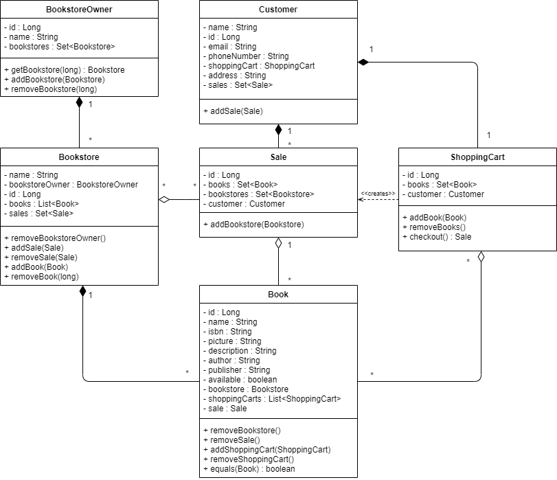

# Amazon Online Bookstore | SYSC 4806 Project

|Team Members           |Role       |
|-----------------------|-----------|
|Mustafa Abdulmajeed    |Server-side|
|Thomas Bryk            |Server-side|
|Dillon Claremont       |Server-side|
|Kaj Hemmingsen-Beriault|Front-end  |
|Nour Raei              |Front-end  |

## Project Description
Bookstore Owner can upload and edit Book information (ISBN, picture, description, author, publisher,...) and inventory. User can search for, and browse through, the books in the bookstore, sort/filter them based on the above information. User can then decide to purchase one or many books by putting them in the Shopping Cart and proceeding to Checkout. The purchase itself will obviously be simulated, but purchases cannot exceed the inventory. User can also view Book Recommendations based on past purchases. This is done by looking for users whose purchases are most similar (using Jaccard distance: Google it!), and then recommending books purchased by those similar users but that the current User hasn't yet purchased.

## UML
#### Class Diagram:

## Milestones
- #### [Milestone 1: Early prototype (March 6th, 2020)](../../milestone/1)
- #### [Milestone 2: Alpha Release (March 20th, 2020)](../../milestone/2)
- #### [Milestone 3: Final demo (April 3rd, 2020)](../../milestone/3)

## Weekly Scrums
1. #### [Weekly Scrum - March 6th, 2020](../../issues/24)
2. #### [Weekly Scrum - March 13th, 2020](../../issues/34)

## Yarn Install for client
- [Install Yarn](https://classic.yarnpkg.com/en/docs/install). To get it started, run from webapp/bookstore with `yarn start`
- If it doesn't work, do `yarn install` in the directory
