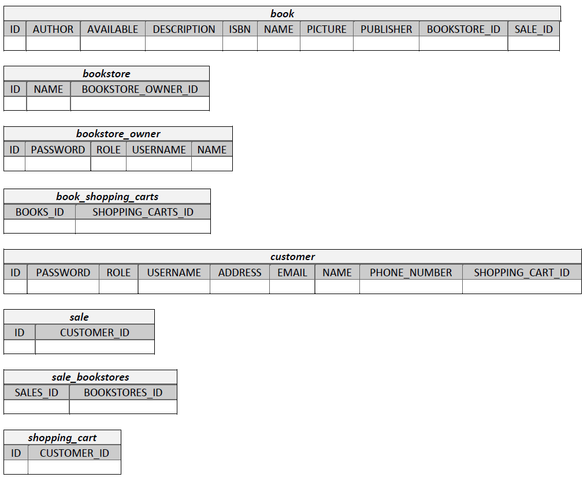

# Amazon Online Bookstore | SYSC 4806 Project

|Team Members           |
|-----------------------|
|Mustafa Abdulmajeed    |
|Thomas Bryk            |
|Dillon Claremont       |
|Kaj Hemmingsen-Beriault|
|Nour Raei              |

## Project Description
Bookstore Owner can upload and edit Book information (ISBN, picture, description, author, publisher,...) and inventory. User can search for, and browse through, the books in the bookstore, sort/filter them based on the above information. User can then decide to purchase one or many books by putting them in the Shopping Cart and proceeding to Checkout. The purchase itself will obviously be simulated, but purchases cannot exceed the inventory. User can also view Book Recommendations based on past purchases. This is done by looking for users whose purchases are most similar (using Jaccard distance: Google it!), and then recommending books purchased by those similar users but that the current User hasn't yet purchased.

## Heroku App
- #### [Heroku App](https://sysc-4806-project-2020.herokuapp.com/)

## Instructions
To perform the basic functionality of the bookstore, follow the instructions below:
1. Create bookstore owner user.
      - Login with bookstore owner username and password.
2. Create bookstore.
3. Fill out the form with book information, and add book to bookstore.
      - Book will be added to the Bookstores list below. Repeat step 3 to multiple books.
4. Return to home page.
5. Create customer user.
      - Login with customer username and password.
5. Select a bookstore to shop from.
      - Select books in bookstore to add to cart.
6. Once your shopping cart contains all books desired, press Checkout.
7. An order will be created below containing the books checked out from shopping cart.

### Instructions for Book Recommendations
To view recommendations for books, perform the following steps:
1. Repeat steps 1-3 in [Instructions](#instructions) to create bookstore owner, bookstore, and books.
      - Create multiple book records of the same book information. Perform this for multiple books (ex. Create two Book1 books, and two Book2 books).
2. Repeat steps 4-5 in [Instructions](#instructions) to create new customer (ex. Customer1).
3. With Customer1, add one copy of Book1 and one copy of Book2 to shopping cart.
      - Once books are in shopping cart, checkout.
4. Return to homepage and repeat steps 4-5 in [Instructions](#instructions) to create new customer (ex. Customer2).
5. With Customer2, add one copy of either Book1 or Book2 to shopping cart.
6. Under Book Recommendations, the book that was not added to shopping cart should appear, since other users who bought the first book also bought the second book.

## Milestones
- #### [Milestone 1: Early prototype (March 6th, 2020)](../../milestone/1)
- #### [Milestone 2: Alpha Release (March 20th, 2020)](../../milestone/2)
- #### [Milestone 3: Final demo (April 3rd, 2020)](../../milestone/3)

## Weekly Scrums
1. #### [Weekly Scrum - March 6th, 2020](../../issues/24)
2. #### [Weekly Scrum - March 13th, 2020](../../issues/34)
3. #### [Weekly Scrum - March 20th, 2020](../../issues/56)
4. #### [Weekly Scrum - March 27th, 2020](../../issues/65)
5. #### [Weekly Scrum - April 3rd, 2020](../../issues/78)

## UML
### Class Diagram:

### Database Schema:

